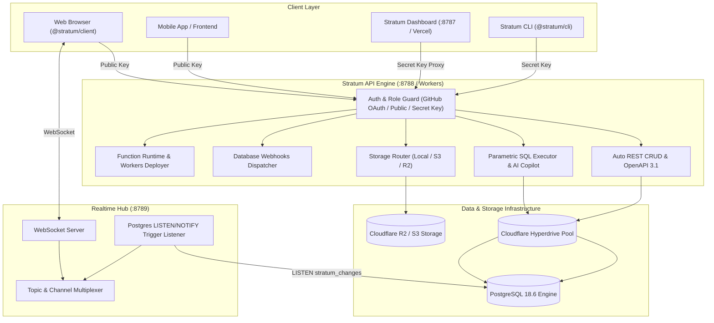

> [!NOTE]
> **[Stratum is live](https://stratum-sh.vercel.app):** High-performance Postgres-native Backend-as-a-Service, automated REST API, real-time change data capture, S3/R2 storage, edge serverless functions, AI SQL assistant, and local-first developer experience.

<div align="center">


# Stratum

### The Modern, Lightweight Backend-as-a-Service for Mission-Critical Web & Edge Applications

**Developed by [Jojin John](https://github.com/jojin1709) • [LinkedIn Profile](https://www.linkedin.com/in/jojin-john/)**

[](https://stratum-sh.vercel.app)
[](https://www.linkedin.com/in/jojin-john/)
[](https://github.com/jojin1709)
[](https://www.typescriptlang.org/)
[](https://turbo.build/)
[](https://www.postgresql.org/)
[](https://cloudflare.com/)
[](./SECURITY.md)
[](./CODE_OF_CONDUCT.md)
[](./CONTRIBUTING.md)
[](./LICENSE)

```bash
# Initialize a new Stratum project in seconds
npx @stratum/cli init my-app
```

</div>

> [!TIP]
> **Zero Cloud Lock-in**: Stratum runs locally with zero dependencies or deploys seamlessly to any VPS, Docker cluster, or edge cloud infrastructure (Cloudflare Workers + Hyperdrive + R2 + PostgreSQL).

---

## 📑 Table of Contents

- [What is Stratum?](#-what-is-stratum)
- [Key Capabilities](#-key-capabilities)
- [System Architecture](#-system-architecture)
- [Verified Benchmarks & Test Suite](#-verified-benchmarks--test-suite)
- [Quick Start Guide](#-quick-start-guide)
- [Subsystems & Workspace Structure](#-subsystems--workspace-structure)
  - [1. Database & Schema Engine (`@stratum/database`)](#1-database--schema-engine-stratumdatabase)
  - [2. Storage Provider (`@stratum/storage`)](#2-storage-provider-stratumstorage)
  - [3. Realtime Engine (`@stratum/realtime`)](#3-realtime-engine-stratumrealtime)
  - [4. Functions & Edge Runtime (`@stratum/functions`)](#4-functions--edge-runtime-stratumfunctions)
  - [5. Isomorphic Client SDK (`@stratum/client`)](#5-isomorphic-client-sdk-stratumclient)
  - [6. Admin Console (`@stratum/dashboard`)](#6-admin-console-stratumdashboard)
  - [7. Command Line Interface (`@stratum/cli`)](#7-command-line-interface-stratumcli)
- [Docker Deployment](#-docker-deployment)
- [Security & Authorization Model](#-security--authorization-model)
- [License & Intellectual Property](#-license--intellectual-property)

---

## 💡 What is Stratum?

**Stratum** is an all-in-one Backend-as-a-Service (BaaS) designed by **Jojin John** for developers who demand complete control over their database, sub-50ms query execution, and zero bloat.

Operating directly on PostgreSQL with Cloudflare Hyperdrive connection pooling, Stratum provides:
- **📊 Interactive Data Grid**: Browse and edit table rows, filter/sort, insert records with typed validation, and delete rows without raw SQL.
- **✨ AI SQL Copilot**: Natural language query assistant transforming plain English into optimized PostgreSQL 18 queries.
- **🔌 Interactive REST API Playground**: Instant parameterised endpoints with built-in live tester and multi-language code generators for **TypeScript, Python, cURL, and Go**.
- **🕸️ Visual Schema ERD**: Interactive entity-relationship diagram rendering tables, columns, primary keys, and relations.
- **⚡ Database Webhooks & Event Triggers**: Stream row `INSERT`, `UPDATE`, and `DELETE` events to external URLs with HMAC SHA-256 signatures.
- **📜 Migration Timeline & DDL Exporter**: Atomic versioned migrations with one-click full PostgreSQL DDL schema export.
- **🔒 GitHub OAuth Security Gate**: Strict authentication protecting the console and database resources.

---

## 🚀 Key Capabilities

| Feature | Stratum Implementation | Benefit |
|---|---|---|
| **Introspected REST** | Generated dynamically from `information_schema` | Zero code required to expose new tables safely |
| **Interactive Data Grid** | Real-time row viewer with typed cell editing & insert modal | Manage data visually without writing manual queries |
| **AI SQL Copilot** | Schema-aware natural language to SQL translation | 10x faster query authoring and diagnostics |
| **Visual Schema ERD** | Dynamic canvas showing tables, PKs, and relations | Instant visual comprehension of database architecture |
| **Database Webhooks** | Outgoing HTTP webhooks triggered on Postgres mutations | Connect with Zapier, Slack, Discord, and external APIs |
| **Multi-Language SDKs** | Code generation for TypeScript, Python, Go, and cURL | Onboard frontend & backend developers immediately |
| **Realtime CDC** | Database trigger `notify_change()` -> Node/WS `LISTEN` | Instant sub-millisecond event streaming to frontends |
| **Zero-Config Storage** | Abstracted provider supporting local disk or Cloudflare R2 | Switch from dev to production with a single env var |
| **Atomic Migrations & DDL** | Transactional `-- +stratum up/down` migrations + DDL export | Guaranteed zero schema drift across environments |

---

## 🏗 System Architecture



---

## 📊 Verified Benchmarks & Test Suite

Stratum is comprehensively tested against live PostgreSQL instances:

| Package / Suite | Tests | Status | Coverage Focus |
|---|:---:|:---:|---|
| `@stratum/shared` | 12 | ✅ Passed | Errors, identifiers, key masking & hashing |
| `@stratum/database` | 23 | ✅ Passed | Dynamic query compiler, DDL builder, migrations |
| `@stratum/storage` | 9 | ✅ Passed | Path safety, S3/local streaming, content headers |
| `@stratum/realtime` | 10 | ✅ Passed | Protocol frame parsing, channel isolation, heartbeats |
| `@stratum/functions` | 9 | ✅ Passed | Worker AST static analysis, invocation sandboxing |
| `@stratum/client` | 13 | ✅ Passed | Type-safe URL queries, query builder, browser safety |
| `@stratum/cli` | 8 | ✅ Passed | Config loading, project init, command routing |
| `apps/api` (Integration) | 35 | ✅ Passed | End-to-end integration tests on live PostgreSQL |
| `apps/dashboard` (E2E) | 35 | ✅ Passed | All 18 Next.js routes & API proxy verified |
| **Total** | **154** | **100% Passed** | Full platform verification |

---

## ⚡ Quick Start Guide

### 1. Prerequisites
- **Node.js**: `>= 20.11.0`
- **pnpm**: `>= 9.0.0`
- **PostgreSQL**: `>= 15` (or Docker)

### 2. Setup Environment
```bash
# Clone the repository
git clone https://github.com/jojin1709/Stratum.git
cd Stratum

# Build all workspace packages
pnpm build

# Run complete test suite
pnpm test
```

### 3. Launch Development Stack
```bash
# Start Postgres via Docker
pnpm db:up

# Launch API and Dashboard
pnpm dev
```

- **API Engine**: `http://localhost:8788`
- **Dashboard**: `http://localhost:8787`
- **Realtime Gateway**: `ws://localhost:8788/realtime/v1`

---

## 📦 Subsystems & Workspace Structure

```
stratum/
├── apps/
│   ├── api/             # Core Hono HTTP API & Cloudflare Worker Gateway
│   └── dashboard/       # Next.js 14 Dark-Mode Console (Vercel Live)
├── packages/
│   ├── cli/             # Developer CLI binary (`stratum`)
│   ├── client/          # Isomorphic TypeScript SDK (@stratum/client)
│   ├── config/          # Centralized configuration & environment loader
│   ├── database/        # PostgreSQL adapter, introspection & migrations
│   ├── functions/       # Serverless function runner & Cloudflare deployer
│   ├── realtime/        # WebSocket hub & PostgreSQL CDC listener
│   ├── shared/          # Shared types, error definitions & cryptography
│   └── storage/         # Local & Cloudflare R2 / S3 storage providers
├── docker-compose.yml   # Multi-service stack definition
└── LICENSE              # Proprietary Software License
```

### 1. Database & Schema Engine (`@stratum/database`)
Provides atomic schema introspection, safe SQL DDL execution, and an irreversible migration manager with SHA-256 verification.

### 2. Storage Provider (`@stratum/storage`)
Unified driver supporting local storage with traversal prevention, and Cloudflare R2 / AWS S3 with signed upload/download URLs.

### 3. Realtime Engine (`@stratum/realtime`)
High-throughput WebSocket multiplexer broadcasting PostgreSQL table row alterations directly to frontends.

### 4. Functions & Edge Runtime (`@stratum/functions`)
Enables zero-overhead local execution of TypeScript/JavaScript serverless handlers and seamless packaging into Cloudflare Workers.

### 5. Isomorphic Client SDK (`@stratum/client`)
```typescript
import { createClient } from '@stratum/client';

const stratum = createClient({
  url: 'https://stratum-api.jojin1709.workers.dev',
  key: 'strat_public_...'
});

// Type-safe queries
const { data, error } = await stratum
  .from('products')
  .select('id, name, price')
  .eq('status', 'active')
  .order('price', { ascending: false })
  .limit(10);

// Realtime subscriptions
stratum
  .channel('products')
  .on('INSERT', (event) => {
    console.log('New product added:', event.record);
  })
  .subscribe();
```

---

## 🐳 Docker Deployment

Stratum includes production-ready Dockerfiles and orchestration configurations:

```bash
# Start complete standalone container stack
docker compose up -d

# View API logs
docker compose logs -f api
```

---

## 🔒 Security & Authorization Model

1. **Role-Based API Keys**:
   - `strat_public_...`: Read and write data according to public permissions.
   - `strat_secret_...`: Administrative access for schema, SQL, and key rotation.
2. **GitHub OAuth Gate**: Restricts administrative console access to authenticated authorized accounts.
3. **Path Traversal Protection**: All object keys and migration paths are strictly sanitized.
4. **In-Memory Rate Limiting**: Token-bucket rate limiting protecting public endpoints.
5. **Header Hardening**: Automatic CSP, HSTS, X-Frame-Options, and download disposition enforcement.

---

## 🤝 Community & Governance

Stratum is built and maintained by **Jojin John** ([@jojin1709](https://github.com/jojin1709)). We adhere to strict engineering, security, and community standards:

- 🛡️ **[Security Policy](./SECURITY.md)**: Vulnerability disclosure & cryptographic integrity.
- 📜 **[Code of Conduct](./CODE_OF_CONDUCT.md)**: Contributor Covenant v2.1 standard.
- 🛠️ **[Contributing Guide](./CONTRIBUTING.md)**: Monorepo workflow, PR guidelines, and testing requirements.
- 💬 **[Support Portal](./SUPPORT.md)**: Documentation links, direct contact, and enterprise inquiries.
- 📝 **[Changelog](./CHANGELOG.md)**: Release versioning notes and breaking changes.
- 🌐 **[LinkedIn Profile](https://www.linkedin.com/in/jojin-john/)**: Connect directly with creator Jojin John.

---

## 📜 License & Intellectual Property

**Copyright (c) 2026 Jojin John. All Rights Reserved.**

This software and associated documentation files (the "Software") are the proprietary and confidential property of **Jojin John**. 

Unauthorized copying, cloning, modifying, distributing, sublicensing, or making available publicly of this software, via any medium, is strictly prohibited without explicit written permission from the author.

---

<div align="center">
  
  <br />
  <b>Stratum BaaS — Developed with precision by <a href="https://www.linkedin.com/in/jojin-john/">Jojin John</a>.</b>
</div>
