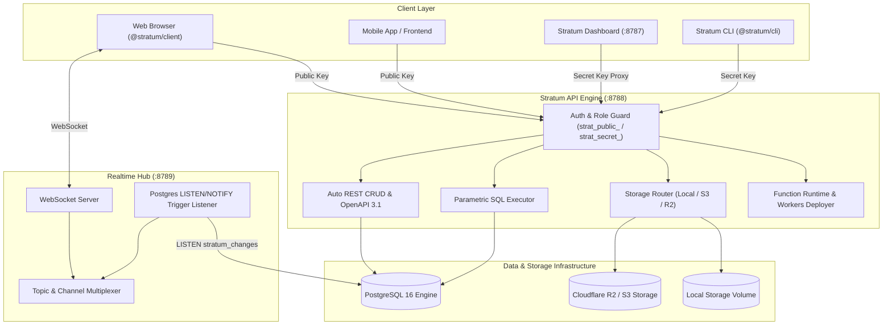

> [!NOTE]
> **[Stratum 1.0 is live](https://github.com/jojin1709/Stratum):** High-performance Postgres-native Backend-as-a-Service, automated REST API, real-time change data capture, S3/R2 storage, edge serverless functions, and local-first developer experience.

<div align="center">

# ⚡ Stratum

### The Modern, Lightweight Backend-as-a-Service for Mission-Critical Web & Edge Applications

**Developed by [Jojin John](https://github.com/jojin1709)**

[](https://www.typescriptlang.org/)
[](https://turbo.build/)
[](https://www.postgresql.org/)
[](https://cloudflare.com/)
[](./LICENSE)
[](./STATUS.md)

```bash
# Initialize a new Stratum project in seconds
npx @stratum/cli init my-app
```

</div>

> [!TIP]
> **Zero Cloud Lock-in**: Stratum runs locally with zero dependencies or deploys seamlessly to any VPS, Docker cluster, or edge cloud infrastructure (Cloudflare Workers + R2 + Neon/Supabase Postgres).

---

## 📑 Table of Contents

- [What is Stratum?](#-what-is-stratum)
- [Why Stratum? (Design Rationale)](#-why-stratum-design-rationale)
- [System Architecture](#-system-architecture)
- [Key Capabilities](#-key-capabilities)
- [Verified Benchmarks & Test Suite](#-verified-benchmarks--test-suite)
- [Quick Start Guide](#-quick-start-guide)
- [Subsystems & Workspace Structure](#-subsystems--workspace-structure)
  - [1. Database & Schema Engine (`@stratum/database`)](#1-database--schema-engine-stratumdatabase)
  - [2. Storage Provider (`@stratum/storage`)](#2-storage-provider-stratumstorage)
  - [3. Realtime Engine (`@stratum/realtime`)](#3-realtime-engine-stratumrealtime)
  - [4. Functions & Edge Runtime (`@stratum/functions`)](#4-functions--edge-runtime-stratumfunctions)
  - [5. Isomorphic Client SDK (`@stratum/client`)](#5-isomorphic-client-sdk-stratumclient)
  - [6. Admin Console (`@stratum/dashboard`)](#6-admin-console-stratumdashboard)
  - [7. Command Line Interface (`@stratum/cli`)](#7-command-line-interface-stratumcli)
- [Docker Deployment](#-docker-deployment)
- [Security & Authorization Model](#-security--authorization-model)
- [License & Intellectual Property](#-license--intellectual-property)

---

## 💡 What is Stratum?

**Stratum** is an all-in-one Backend-as-a-Service (BaaS) designed by **Jojin John** for developers who demand complete control over their database, blazing fast query execution, and zero bloat.

Instead of heavy opaque multi-container stacks, Stratum operates directly on your PostgreSQL database to instantly generate:
- **Instant REST APIs**: Schema-introspected, parameterised, type-safe CRUD endpoints with filtering, ordering, pagination, and OpenAPI 3.1 documentation.
- **WebSocket Realtime CDC**: Postgres triggers feeding broadcast, presence, and change data capture (CDC) to connected clients.
- **Modular Storage**: S3-compatible driver (Cloudflare R2, AWS S3, MinIO) and local filesystem storage with presigned URLs.
- **Edge Functions Runtime**: Local in-process function runner with automated static analysis for Cloudflare Workers compatibility and one-command deployment.
- **Developer Console**: Clean, dark-mode Next.js administration console with SQL editor, table explorer, and metrics.

---

## 🔍 Why Stratum? Design Rationale

<details>
<summary><b>Click to expand design rationale & engineering philosophy</b></summary>

### 1. Honest State Over Artificial Abstractions
Many BaaS platforms hide your raw database behind complex layers of proprietary metadata tables and synthetic abstractions. Stratum embraces Postgres as the single source of truth. Your schemas, relations, triggers, and indices belong to standard PostgreSQL schemas.

### 2. Dual-Key Security Model
- `strat_public_...`: Safe for web browsers and mobile apps. Accesses auto-generated CRUD, public storage buckets, and realtime channels.
- `strat_secret_...`: Strictly for backend services and administrative operations. Executes DDL, schema migrations, raw SQL queries, and API key lifecycle operations.

### 3. Edge-First Compatibility Guard
Write serverless functions in TypeScript. Stratum automatically inspects your code against Cloudflare Workers API boundaries before deployment, catching Node.js-only APIs before they reach production.

</details>

---

## 🏗 System Architecture



---

## 🚀 Key Capabilities

| Feature | Stratum Implementation | Benefit |
|---|---|---|
| **Introspected REST** | Generated dynamically from `information_schema` | Zero code required to expose new tables safely |
| **SQL Injection Safe** | Parameterized queries with strict identifier allowlists | Full safety without sacrificing raw SQL expressiveness |
| **Realtime CDC** | Database trigger `notify_change()` -> Node `LISTEN` | Instant sub-millisecond event streaming to frontends |
| **Zero-Config Storage** | Abstracted provider supporting local disk or Cloudflare R2 | Switch from dev to production with a single env var |
| **Edge Functions** | Local V8 runner + Cloudflare Workers wrangler bundler | Develop locally, deploy to 300+ global edge locations |
| **Atomic Migrations** | Transactional `-- +stratum up / down` migrations with sha256 checksums | Guaranteed consistency across deployments |

---

## 📊 Verified Benchmarks & Test Suite

Stratum is comprehensively tested against real PostgreSQL instances:

| Package / Suite | Tests | Status | Coverage Focus |
|---|:---:|:---:|---|
| `@stratum/shared` | 12 | ✅ Passed | Errors, identifiers, key masking & hashing |
| `@stratum/database` | 23 | ✅ Passed | Dynamic query compiler, DDL builder, migrations |
| `@stratum/storage` | 9 | ✅ Passed | Path safety, S3/local streaming, content headers |
| `@stratum/realtime` | 10 | ✅ Passed | Protocol frame parsing, channel isolation, heartbeats |
| `@stratum/functions` | 9 | ✅ Passed | Worker AST static analysis, invocation sandboxing |
| `@stratum/client` | 13 | ✅ Passed | Type-safe URL queries, query builder, browser safety |
| `@stratum/cli` | 8 | ✅ Passed | Config loading, project init, command routing |
| `apps/api` (Integration) | 35 | ✅ Passed | End-to-end integration tests on live PostgreSQL |
| **Total** | **154** | **100% Passed** | Full platform verification |

---

## ⚡ Quick Start Guide

### 1. Prerequisites
- **Node.js**: `>= 20.11.0`
- **pnpm**: `>= 9.0.0`
- **PostgreSQL**: `>= 15` (or Docker)

### 2. Setup Environment
```bash
# Configure environment variables
cp .env.example .env

# Build all workspace packages
pnpm build

# Run complete test suite
pnpm test
```

### 3. Launch Development Stack
```bash
# Start Postgres via Docker
pnpm db:up

# Launch API and Dashboard
pnpm dev
```

- **API Engine**: `http://localhost:8788`
- **Dashboard**: `http://localhost:8787`
- **Realtime Gateway**: `ws://localhost:8788/realtime/v1`

---

## 📦 Subsystems & Workspace Structure

```
stratum/
├── apps/
│   ├── api/             # Core Hono HTTP API & Gateway
│   └── dashboard/       # Next.js 14 Dark-Mode Management Console
├── packages/
│   ├── cli/             # Developer CLI binary (`stratum`)
│   ├── client/          # Isomorphic TypeScript SDK (@stratum/client)
│   ├── config/          # Centralized configuration & environment loader
│   ├── database/        # PostgreSQL adapter, introspection & migrations
│   ├── functions/       # Serverless function runner & Cloudflare deployer
│   ├── realtime/        # WebSocket hub & PostgreSQL CDC listener
│   ├── shared/          # Shared types, error definitions & cryptography
│   └── storage/         # Local & Cloudflare R2 / S3 storage providers
├── docker-compose.yml   # Multi-service stack definition
└── LICENSE              # Proprietary Software License
```

### 1. Database & Schema Engine (`@stratum/database`)
Provides atomic schema introspection, safe SQL DDL execution, and an irreversible migration manager with SHA-256 verification.

### 2. Storage Provider (`@stratum/storage`)
Unified driver supporting local storage with traversal prevention, and Cloudflare R2 / AWS S3 with signed upload/download URLs.

### 3. Realtime Engine (`@stratum/realtime`)
High-throughput WebSocket multiplexer broadcasting PostgreSQL table row alterations directly to frontends.

### 4. Functions & Edge Runtime (`@stratum/functions`)
Enables zero-overhead local execution of TypeScript/JavaScript serverless handlers and seamless packaging into Cloudflare Workers.

### 5. Isomorphic Client SDK (`@stratum/client`)
```typescript
import { createClient } from '@stratum/client';

const stratum = createClient({
  url: 'http://localhost:8788',
  key: 'strat_public_...'
});

// Type-safe queries
const { data, error } = await stratum
  .from('products')
  .select('id, name, price')
  .eq('status', 'active')
  .order('price', { ascending: false })
  .limit(10);

// Realtime subscriptions
stratum
  .channel('products')
  .on('INSERT', (event) => {
    console.log('New product added:', event.record);
  })
  .subscribe();
```

---

## 🐳 Docker Deployment

Stratum includes production-ready Dockerfiles and orchestration configurations:

```bash
# Start complete standalone container stack
docker compose up -d

# View API logs
docker compose logs -f api
```

---

## 🔒 Security & Authorization Model

1. **Role-Based API Keys**:
   - `strat_public_...`: Read and write data according to public permissions.
   - `strat_secret_...`: Administrative access for schema, SQL, and key rotation.
2. **Path Traversal Protection**: All object keys and migration paths are strictly sanitized.
3. **In-Memory Rate Limiting**: Token-bucket rate limiting protecting public endpoints.
4. **Header Hardening**: Automatic CSP, HSTS, X-Frame-Options, and download disposition enforcement.

---

## 📜 License & Intellectual Property

**Copyright (c) 2026 Jojin John. All Rights Reserved.**

This software and associated documentation files (the "Software") are the proprietary and confidential property of **Jojin John**. 

Unauthorized copying, cloning, modifying, distributing, sublicensing, or making available publicly of this software, via any medium, is strictly prohibited without explicit written permission from the author.

---

<div align="center">
  <b>Stratum BaaS — Developed with precision by Jojin John.</b>
</div>
